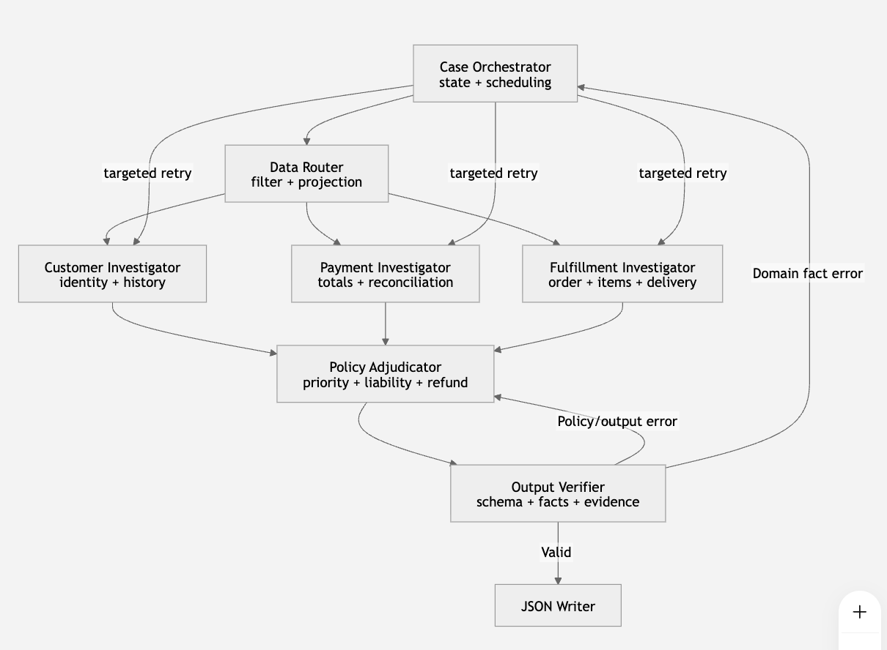
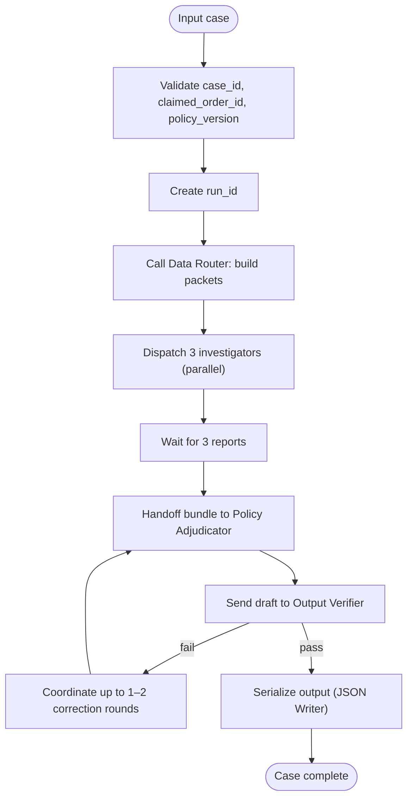
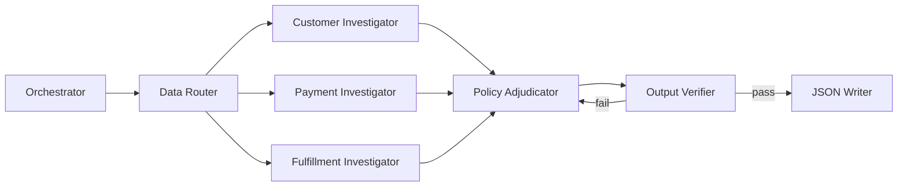

**1. Kiến trúc đề xuất**



Đây là sự kết hợp của ba luồng chính:

| Giai đoạn | Flow sử dụng | Lý do |
|---|---|---|
| Điều tra dữ liệu | Supervisor–Worker / Cooperative Search | Ba investigator đọc các phần dữ liệu khác nhau và chạy song song |
| Ra quyết định | Handover / Pipeline | `Policy Adjudicator` nhận kết quả điều tra rồi mới quyết định |
| Kiểm tra | Self-Correction | `Output Verifier` kiểm tra draft và trả lỗi có cấu trúc để sửa |
| Ghi output | Deterministic pipeline | Ghi JSON là bước deterministic, không cần LLM |

**2. Các thành phần cụ thể**
2.1. Case Orchestrator

Đây là supervisor của toàn bộ hệ thống.

### Case Orchestrator — luồng và nhiệm vụ



Nhiệm vụ theo trình tự (concise):

1. Nhận input case.
2. Xác thực `case_id`, `claimed_order_id`, `policy_version`.
3. Tạo `run_id` và khởi tạo state.
4. Gọi `Data Router` để chuẩn hóa dữ liệu và tạo packets.
5. Khởi chạy `Customer`, `Payment`, `Fulfillment` investigators song song.
6. Chờ và thu 3 báo cáo có cấu trúc.
7. Gửi bundle cho `Policy Adjudicator` để dựng `case_draft`.
8. Gửi `case_draft` cho `Output Verifier`.
9. Nếu verifier fail → điều phối tối đa 1–2 vòng sửa nghiệm thu trên các field bị chỉ định.
10. Nếu verifier pass → gọi `JSON Writer` để ghi file vào `output/`.

Orchestrator quản lý trạng thái đơn giản; ví dụ state mẫu:

```json
{
  "run_id": "run_20260805_001",
  "case_id": "EC_001",
  "claimed_order_id": "...",
  "stage": "investigating",
  "completed_agents": [],
  "retry_count": 0,
  "errors": []
}
```
3.2. Case Data Router

Data Router nên là code/tool xác định, không cần là một LLM agent.

Đây là lớp ngăn các agent phải đọc toàn bộ CSV hoặc nhận một context khổng lồ.

Nhiệm vụ
Dùng claimed_order_id lấy đúng các dòng liên quan.
Join hoặc truy vấn dữ liệu cần thiết.
Tạo ba context packet nhỏ cho ba investigator.
Chuẩn hóa timestamp và kiểu dữ liệu.
Không tính kết luận nghiệp vụ.
Tại sao cần Router?

Nếu đưa toàn bộ order, customer history, item, seller, payment và product vào mọi prompt:

Context bị lặp.
Model dễ lấy nhầm trường.
Trace rất dài.
Chi phí và thời gian chạy tăng.
Khó xác định agent nào chịu trách nhiệm khi có lỗi.

Router chỉ gửi đúng dữ liệu mà agent cần.

4. Ba investigator chạy song song
4.1. Customer Investigator

Agent này chỉ chịu trách nhiệm về danh tính và lịch sử khách hàng.

Dữ liệu được phép nhận
{
  "case_id": "EC_001",
  "claimed_order_id": "...",
  "current_customer_id": "...",
  "current_customer_unique_id": "...",
  "customer_orders": [
    {
      "order_id": "...",
      "customer_id": "...",
      "order_purchase_timestamp": "...",
      "order_status": "..."
    }
  ]
}

Không cần nhận:

Payment rows.
Product details.
Seller data.
Shipping limits.
Nội dung policy đầy đủ.
Nhiệm vụ
Xác nhận customer_unique_id.
Tìm các order khác của cùng khách hàng.
Loại order đang điều tra khỏi lịch sử.
Sắp xếp lịch sử theo quy tắc ổn định.
Giới hạn tối đa 5 related orders.
Xác định có repeat_customer hay không.
Output contract
{
  "agent": "customer_investigator",
  "case_id": "EC_001",
  "customer_unique_id": "...",
  "related_order_ids": ["..."],
  "repeat_customer": true,
  "source_row_counts": {
    "customer_rows": 1,
    "related_order_rows": 2
  },
  "warnings": []
}

Agent này không được đưa repeat_customer trực tiếp vào final output. Nó chỉ báo fact cho Policy Adjudicator.

4.2. Payment Investigator

Agent này chịu trách nhiệm toàn bộ phần đối soát tài chính.

Dữ liệu được phép nhận

Không cần truyền toàn bộ item/product. Router chỉ truyền các trường tài chính:

{
  "case_id": "EC_001",
  "order_id": "...",
  "item_financial_rows": [
    {
      "order_item_id": 1,
      "price": 194.0,
      "freight_value": 18.27
    }
  ],
  "payment_rows": [
    {
      "payment_sequential": 1,
      "payment_type": "credit_card",
      "payment_installments": 2,
      "payment_value": 200.0
    },
    {
      "payment_sequential": 2,
      "payment_type": "voucher",
      "payment_installments": 1,
      "payment_value": 12.27
    }
  ]
}
Nhiệm vụ
Tính item_total_brl.
Tính freight_total_brl.
Tính expected_total_brl.
Tính payment_total_brl.
Tính difference_brl.
Xác định reconciled.
Xác định có split payment hay không.
Tạo payment IDs.
Giữ thứ tự payment type ổn định.
Xử lý order không có item.
Không nhân payment_value với payment_installments.
Output contract
{
  "agent": "payment_investigator",
  "case_id": "EC_001",
  "payment_reconciliation": {
    "currency": "BRL",
    "item_total_brl": 194.0,
    "freight_total_brl": 18.27,
    "expected_total_brl": 212.27,
    "payment_total_brl": 212.27,
    "difference_brl": 0.0,
    "reconciled": true,
    "payment_types": ["credit_card", "voucher"]
  },
  "payment_ids": [
    "<order_id>:1",
    "<order_id>:2"
  ],
  "payment_row_count": 2,
  "split_payment": true,
  "warnings": []
}
Nên tính bằng code hay LLM?

Các phép cộng và làm tròn nên được thực hiện bằng Python/tool xác định. Agent có thể:

Chọn tool.
Kiểm tra dữ liệu thiếu.
Giải thích kết quả.
Trả structured output.

Không nên yêu cầu LLM tự cộng nhiều dòng tiền bằng suy luận văn bản.

4.3. Fulfillment Investigator

Agent này kết hợp:

Order.
Item.
Product.
Seller.
Delivery.

Việc gộp này là có chủ đích vì các domain này liên kết chặt chẽ trong việc xác định seller giao muộn.

Dữ liệu được phép nhận
{
  "case_id": "EC_001",
  "order": {
    "order_id": "...",
    "order_status": "delivered",
    "order_delivered_customer_date": "...",
    "order_estimated_delivery_date": "...",
    "order_delivered_carrier_date": "..."
  },
  "item_rows": [
    {
      "order_item_id": 1,
      "product_id": "...",
      "seller_id": "...",
      "shipping_limit_date": "...",
      "category_name": "..."
    }
  ]
}

Agent không cần nhận:

Customer history.
Payment types.
customer_request.message.
Toàn bộ policy và refund rules.
Nhiệm vụ
Tạo item IDs.
Tạo seller IDs.
% Kiến trúc đề xuất


Tóm tắt: hệ thống kết hợp ba luồng chính — điều tra song song bởi các investigator, ra quyết định theo pipeline bởi `Policy Adjudicator`, và kiểm tra độc lập bởi `Output Verifier`. Ghi file kết quả là bước deterministic không cần LLM.

## Luồng



## Thành phần chính

- **Case Orchestrator**: điều phối case, tạo `run_id`, gọi `Data Router`, khởi chạy 3 investigator song song, chờ kết quả, gửi bundle tới `Policy Adjudicator`, lưu trace và quản lý tối đa 2 lượt sửa.

- **Case Data Router** (deterministic tool): truy vấn và chuẩn hóa dữ liệu từ CSV, tạo 3 packets (customer, payment, fulfillment) hạn chế kích thước và nội dung, cung cấp `canonical_source_index` cho verifier.

- **Customer Investigator**: xác nhận `customer_unique_id`, chọn tối đa 5 related orders, trả `related_order_ids` và `repeat_customer` (fact).

- **Payment Investigator**: tính toán chính xác các tổng tài chính bằng code: `item_total_brl`, `freight_total_brl`, `expected_total_brl`, `payment_total_brl`, `difference_brl`; trả `reconciled`, `payment_ids`, `payment_row_count`, `split_payment`.

- **Fulfillment Investigator**: tổng hợp order/item/seller, tính `delivery_variance_hours`, xác định `delivered_late` và `late_handoff_seller_ids`, trả các ID và `delivery_analysis` chi tiết.

- **Policy Adjudicator**: duy nhất được phép quyết định `primary_issue` và `secondary_issues` bằng deterministic rule engine, nhận inputs là structured reports từ 3 investigator và `policy_version`.

- **Output Verifier**: độc lập, chạy các kiểm tra schema, cross-field, evidence, limits, tài chính, và replay deterministic policy để validate; trả `pass` hoặc `fail` với danh sách lỗi kèm patch instructions.

## Bảng: Vai trò và dữ liệu

| Thành phần | Nhiệm vụ chính | Đầu vào chính | Đầu ra chính |
|---|---:|---|---|
| Orchestrator | Điều phối | input case | run state, trace |
| Data Router | Truy vấn & chuẩn hóa | CSV, claimed_order_id | customer/payment/fulfillment packets, canonical index |
| Customer Investigator | Khai thác thông tin khách hàng | customer packet | customer_report (related_order_ids, repeat_customer) |
| Payment Investigator | Đối soát tài chính | payment packet | payment_report (item_total, payment_total, reconciled, payment_ids) |
| Fulfillment Investigator | Phân tích giao nhận | fulfillment packet | fulfillment_report (delivered_late, late_handoff_seller_ids, delivery_analysis) |
| Policy Adjudicator | Ra quyết định theo policy | 3 reports + policy_version | case_draft (primary_issue, secondary_issues, recommended_refund_brl, evidence_ids) |
| Output Verifier | Xác thực kết quả | case_draft + canonical index | {status: pass|fail, errors[]} |

## Quy tắc chính

- `Data Router` chỉ gửi projection cần thiết cho từng investigator; không chuyển toàn bộ CSV.
- Các phép tính tiền (cộng, làm tròn) thực hiện bằng mã/tiện ích, không làm bằng LLM.
- `Policy Adjudicator` áp dụng engine quy tắc deterministic theo thứ tự ưu tiên sau:

```text
ưu_tiên:
  1. canceled_order_paid
  2. unavailable_order_paid
  3. late_delivery_seller
  4. late_delivery_logistics
  5. valid_split_payment
  6. unsupported_late_claim
```

Ví dụ luật (pseudocode):

```text
if order_status == "canceled" and payment_total > 0:
  primary_issue = "canceled_order_paid"
elif order_status == "unavailable" and payment_total > 0:
  primary_issue = "unavailable_order_paid"
elif delivered_late and late_handoff_seller_ids:
  primary_issue = "late_delivery_seller"
elif delivered_late and not late_handoff_seller_ids:
  primary_issue = "late_delivery_logistics"
elif payment_row_count >= 2 and reconciled:
  primary_issue = "valid_split_payment"
else:
  primary_issue = "unsupported_late_claim"
```

## Kiểm tra (Verifier)

- Schema: các trường bắt buộc, kiểu dữ liệu, định dạng timestamp, trường `confidence` trong khoảng [0,1].
- Kiểm tra chéo: ví dụ `recommended_refund_brl > 0` ⇒ `case_status == action_required`; `primary_issue == valid_split_payment` ⇒ `reconciled == true` và `payment_row_count >= 2` và `recommended_refund_brl == 0`.
- Bằng chứng: mọi `evidence_ids` phải tồn tại trong `canonical_source_index`.
- Giới hạn: kiểm tra các ngưỡng cấu hình (ví dụ danh sách 3/5/20 phần tử).
- Tài chính: tính lại `expected = item_total + freight_total` và `difference = payment_total - expected`.
- Replay policy: chạy lại hàm policy deterministic để xác nhận `primary_issue`.

## Chuyển lỗi

| Mã lỗi | Chuyển tới |
|---|---|
| CUSTOMER_ID_MISMATCH | Customer Investigator |
| RELATED_ORDER_INVALID | Customer Investigator |
| PAYMENT_TOTAL_MISMATCH | Payment Investigator |
| RECONCILIATION_ERROR | Payment Investigator |
| DELIVERY_VARIANCE_ERROR | Fulfillment Investigator |
| INVALID_LATE_SELLER | Fulfillment Investigator |
| POLICY_PRIORITY_VIOLATION | Policy Adjudicator |
| REFUND_RULE_ERROR | Policy Adjudicator |
| SCHEMA_ERROR | Policy Adjudicator / Formatter |
| UNKNOWN_EVIDENCE_ID | Policy Adjudicator |

## Ghi chú vận hành

- Song song: chạy các investigators trong cùng một case đồng thời; giới hạn số case chạy cùng lúc (ví dụ `MAX_CASE_CONCURRENCY = 5`).
- Trace: ghi một sự kiện JSONL cho mỗi event của agent (started/completed/verification), không ghi prompt hoặc chain-of-thought.
- Ghi file: chỉ serialize `output/EC_xxx.json` khi `Output Verifier` trả `pass`.

---

Nếu muốn, tôi có thể tiếp tục: 1) tách một bản tóm tắt ngắn cho README, hoặc 2) tạo sơ đồ chi tiết hơn cho từng agent. Bạn muốn gì tiếp theo?

## Model runtime thực tế

Chạy model-assisted dùng `python3 run.py --case-concurrency 5 --model-mode required`. Mỗi investigator gửi projection và computed report sang `qwen2.5:7b`; Policy Adjudicator và Output Verifier gửi structured bundle/draft sang `llama3:8b`. Ollama bị ràng buộc bằng JSON Schema `status/issues`, temperature 0 và seed 42. Model chỉ audit; `Decimal`, datetime, policy engine và canonical verifier vẫn sở hữu field chấm điểm.

Trace event `model_call_completed` ghi model ID, agent, prompt/completion token, duration, số attempt và trạng thái, nhưng không ghi prompt hoặc chain-of-thought. Run gần nhất `run_20260805_162438` có 50 verification pass, 50 output written và 268 structured model calls thành công. Qwen có số call lớn hơn 150 vì 9 case được resume sau khi response giới hạn 80 tokens ban đầu bị cắt; hệ thống strict đã không ghi các case đó cho tới khi constrained JSON Schema pass.
